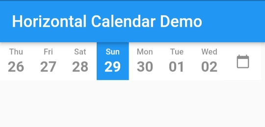

# Horizontal Calendar
 A flutter plugin to show horizontal view of calendar with date picker
 

## Installation
In the dependencies: section of your pubspec.yaml, add the following line:

<pre>  pin_code_view: 0.2.1</pre>

